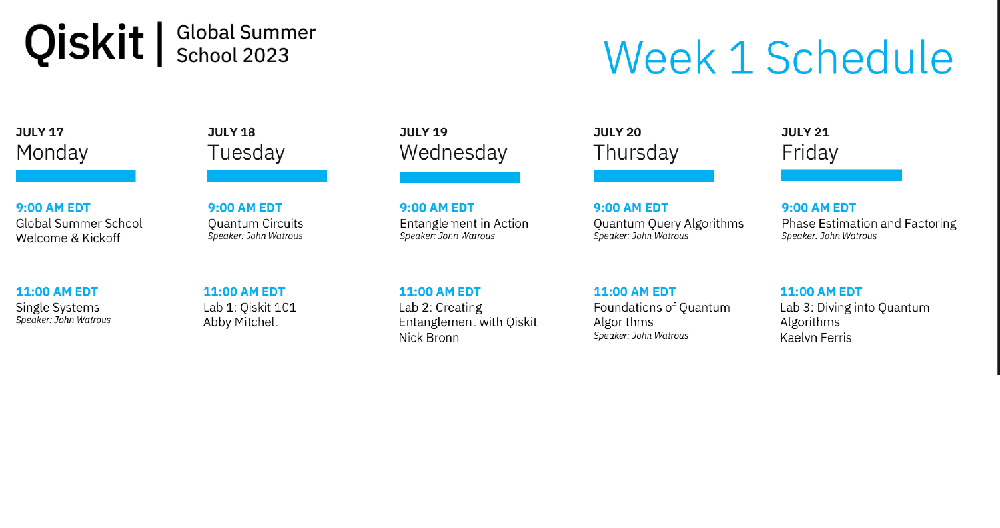
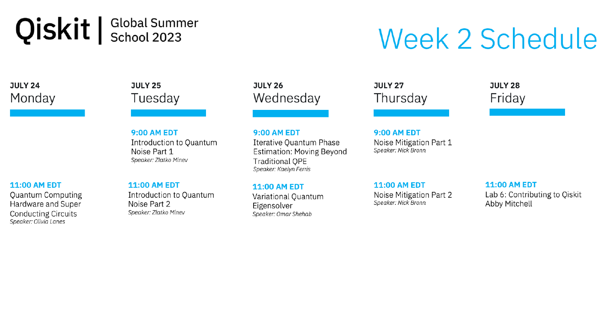

# Qiskit Global Summer School 2023
All Lecture Notes and Attendee Guide can be found in  [Github Qiskit Global Summer School 2023](https://github.com/anamariarojas123/Qiskit-Global-Summer-School-2023/blob/main/Attendee%20Guide/QGSS23_AttendeeGuide.pdf).

Useful resources:

* https://realpython.com/python-complex-numbers/
* https://www.markdownguide.org/basic-syntax/
* Latex mathematical symbols : https://www.cmor-faculty.rice.edu/~heinken/latex/symbols.pdf
* rendering greece letter in markdown - https://rpruim.github.io/s341/S19/from-class/MathinRmd.html
